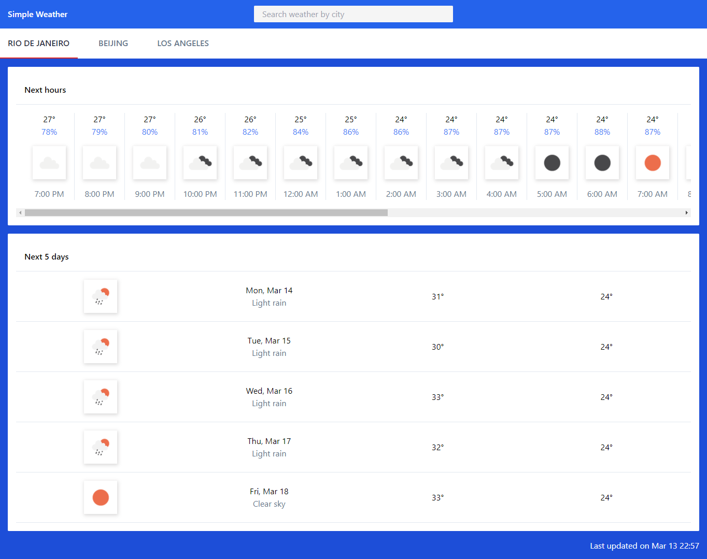

An application which will show the weather forecast information for the "Next hours" and "Next 5 days" for various cities around the world

* Initially three tabs will be shown for cities - Rio de Janeiro, Beijing and Los Angeles
* There is a city search functionality which can be used to view the weather information for 20,000 cities around the world
* The "Next hours" section will show the weather forecast information for the next 24 hours of the respective city
* The "Next 5 days" section will show the weather forecast information for the next 5 days of the respective city

### Frontend

#### Frontend Application Stack

UI Framework - Vue.js (version-3.2.13) 
State management - Vuex
CSS framework - Tailwind Css

#### Steps to run

* Please run `npm install`
* .env.example file has default values for configuration needed by the frontend code. Make a copy of .env.example file and rename it to .env
* Replace the default values accordingly

#### Development server

To start the frontend, run `npm run serve` for a dev server. Navigate to `http://localhost:8080/`.

### Backend

#### Backend Application Stack

Nest.js

#### Steps to run

* Please run `npm install`
.env.example file has default values for configuration needed by the backend code. Make a copy of .env.example file and rename it to .env
* Replace the default values accordingly

#### Development Server

To start the backend, run `npm run start:dev`. The dev server should start on `http://localhost:3000/`.

### Scope of Improvement

* Use of a component library for UI frontend components
* Currently weather units are hardcoded on the frontend, we can fetch these from the server on initial load of the application
* As the application grows, a better error handling can be implemented
* Open api can be used for api routes which can further be used to generate common models between frontend and backend
* Better typescript typechecking and integration
* Unit testing & end-to-end testing

### Screenshots

   
   
   

